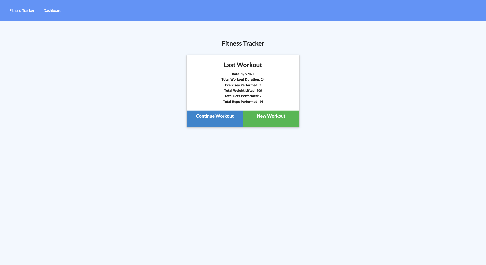
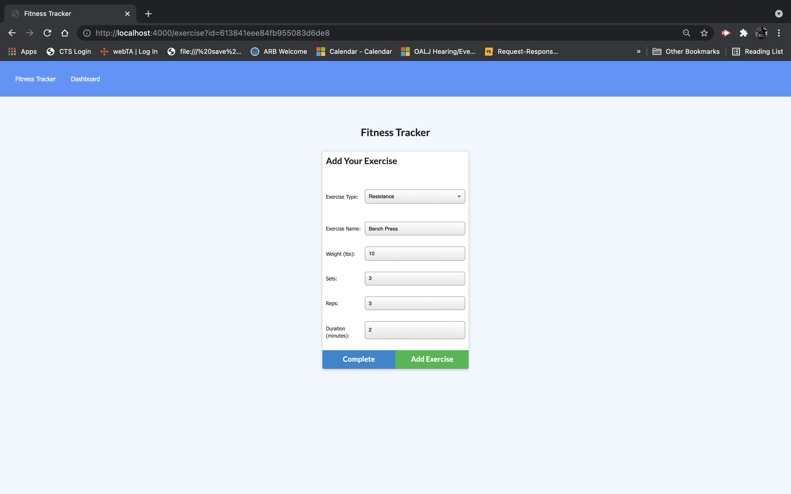
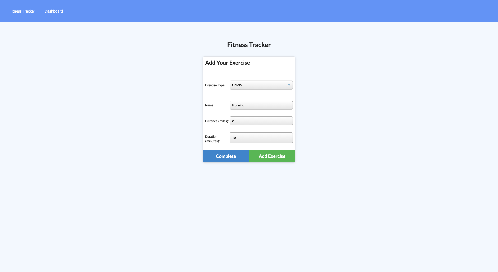
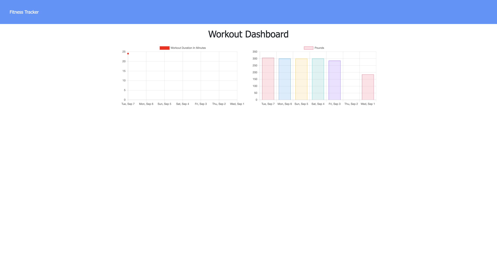

# workout_tracker

# Table of Contents

- [Description](#description)
- [Visuals](#visuals)
- [Installation](#installation)
- [User_Story](#user_story)
- [Usage](#business_Context)
- [Links](#links)

## Description

This is a workout tracker using the Mongo database with a Mongoose schema and handle routes with Express. When the user loads the page, they are given the option to create a new workout or continue with their last workout.

## Visuals 

 
 
 
 

## Installation 

To run this program locally npm i to install dependencies and then run npm run seed to populate seeded data. Finally run node server.js and open local host 4000 in browswer. 

## User Story

As a user, I want to be able to view create and track daily workouts. I want to be able to log multiple exercises in a workout on a given day. I should also be able to track the name, type, weight, sets, reps, and duration of exercise. If the exercise is a cardio exercise, I should be able to track my distance traveled.

## Business Context

A consumer will reach their fitness goals more quickly when they track their workout progress.

## Links

https://github.com/Jashawns/workout_tracker